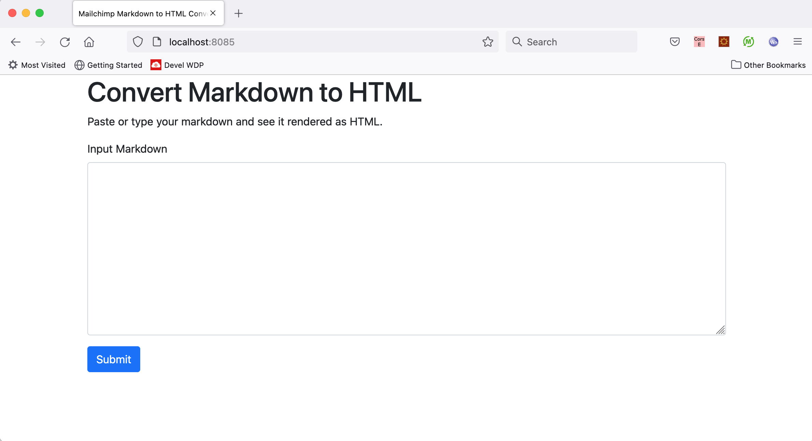

# Markdown to HTML Converter
Markdown is a simple syntax used to generate formatted text. This compiler converts a small subset of markdown to HTML which include Heading, Paragraphs and Links

This is a spring boot application. Please follow below steps to build and run the markdown to html converter

### Prerequisites: 
You will need [Java 11](https://www.java.com/en/) or higher. Before you begin, you should check your current Java installation by using the following command:

`java -version`

If there is a version of Java 11 present, then that is fine else please install it.

### 1. Building and running application

Mac OS
```
git clone https://github.com/shasikalap/markup-compiler-java.git
cd markdown-compiler-java
./gradlew clean build
./gradlew bootRun
```

Windows
```
git clone https://github.com/shasikalap/markup-compiler-java.git
cd markdown-compiler-java
gradlew.bat clean build
gradlew.bat bootRun
```

### 2. Running application from jar
If you dont want to build application then you can just use the latest jar attached 

```
cd markdown-compiler-java
java -jar markup-compiler-0.0.1.jar
```

Markdown to HTML Converter should now be available on [localhost](http://localhost:8085) as shown below



